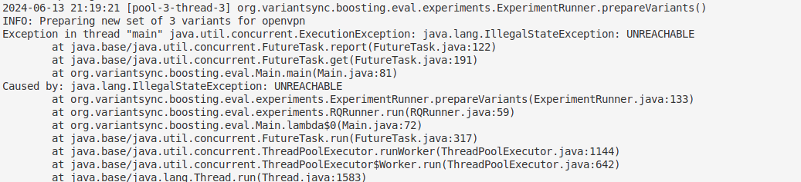

[](https://variantsync.github.io/trace-boosting-eval/)
[](LICENSE.LGPL3)

# Evaluation Artifact for "Give an Inch and Take a Mile? Effects of Adding Reliable Knowledge to Heuristic Feature Tracing"

This repository contains the artifact for our paper _Give an Inch and Take a Mile? Effects of Adding Reliable Knowledge to Heuristic Feature Tracing_ 
which is accepted at the 28th ACM International Systems and Software Product Line Conference ([SPLC 2024](https://2024.splc.net/)).
The project comprises the source code running the empirical evaluation of our **boosted comparison-based feature tracing** algorithm, 
which is implemented as a library in a separate open-source [GitHub repository](https://github.com/VariantSync/trace-boosting). 

Our algorithm is designed to enhance the accuracy of retroactive heuristic feature tracing with proactively collected feature traces.
Particularly, the algorithm can be used for projects with multiple product variants. 
There, it can improve the accuracy and efficiency of the tracing process by exploiting reliable manual knowledge. 


## Obtaining this Artifact
Clone the repository to a location of your choice using [git](https://git-scm.com/docs/git-clone):
  ```sh
  git clone https://github.com/VariantSync/trace-boosting-eval.git  
```

### (Optional) Download the experiment data
> This is done automatically by the Docker script and is only required if you plan on interacting directly with the data. 

Open a terminal in the cloned directory and execute the setup script. 
The script downloads the required data files which consists of the subject repositories and their ground truth from [Zenodo](https://doi.org/10.5281/zenodo.11472597). 
```sh 
./setup.sh
```

## Getting Started: Requirements, Installation, and Validation using Docker

The following paragraphs explain how to run the experiments from the paper by using Docker. 
An explanation how to run the Java implementation from source follows thereafter.

### Docker Setup Instructions
* Install [Docker](https://docs.docker.com/get-docker/) on your system and start the [Docker Daemon](https://docs.docker.com/config/daemon/start/).
> Depending on your Docker installation, you might require elevated permission (i.e., sudo) to call the Docker daemon under Linux. 
* Open a terminal and navigate to the project's root directory
* Build the docker image by calling the build script corresponding to your OS

> Under MacOS the image's and host's platform might not match. 
Therefore, we added a separate `build-on-mac` script for MacOS users in which the platform can be specified. 
If there is a mismatch, Docker will print a warning at the start of the build process that states the used platforms. Please update the required platform in the build script in accordance with your host platform. 
  ```sh
  # Windows:
  build.bat
  # Linux:
  ./build.sh
  # MacOS - you might have to change the platform in the script according to your hardware; see the troubleshooting section for more information
  ./build-on-mac.sh

  ```
* You can validate the installation by calling the validation corresponding to your OS. The validation runs about
  __`30 minutes`__ depending on your system.

  ```shell
  # Windows:
  execute.bat validation
  # Linux | MacOS:
  execute.sh validation
  ```
  The script will generate figures and tables similar to the ones presented in our paper. They are automatically saved to
  `./results`.

  **Please note:** In the provided default configuration (data/validation.properties), the experiment is run only on one set of variants.
* If those are well-aligned, the result of the accuracy-metrics may be one, meaning all feature traces are computed correctly.
* For a higher amount of compared variants and for a higher amount of proactive traces, highly accurate traces can be expected.

## Executing the Experiments Using Docker

* All commands in this section are supposed to be executed in a terminal with working directory at the evaluation-repository's project
root.
* You can stop the execution of any experiment by running the following command in another terminal:
  ```shell
  # Windows Command Prompt:
  stop-execution.bat
  # Windows PowerShell:
  .\stop-execution.bat
  # Linux | MacOS
  ./stop-execution.sh
  ```
Stopping the execution may take a moment.

### Running all Experiments
You can repeat the experiments exactly as presented in our paper. 
The following command executes 30 runs of the experiments
for RQ1 and RQ2.

**Please note:** Due to comparing potentially large files, mapped to tree-structures, and feature expressions, 
the entire experiment requires high amounts of RAM (> 24GB) and several hours up to days (depending on the hardware capabilities). 
To achieve results faster, we recommend to reduce the executions, for instance by examining only one subject each. 
Similar, the lower the number of compared variants, the faster the experiment finishes.

```shell
# Windows Command Prompt:
execute.bat replication
# Windows PowerShell:
.\execute.bat replication
# Linux | MacOS
./execute.sh replication
```


**Please note further**: The variants for which feature traces are computed are determined randomly.
Thus, if you replicate our experiment with exactly the same setup, the results may not be exactly the same.
However, the general trend of boosting the accuracy should be visible for all computed metrics in a very similar matter.


### Docker Experiment Configuration
By default, the properties used by Docker are configured to run the experiments as presented in our paper. We offer the
possibility to change the default configuration.
* Open the properties file in [data](data) which you want to adjust
    * [`replication.properties`](data/replication.properties) configures the experiment execution
      of `execute.(bat|sh) replication`
    * [`validation.properties`](data/validation.properties) configures the experiment execution of  
      `execute.(bat|sh) validation`
* Change the properties to your liking
* Rebuild the docker image as described above
* Delete old results in the `./results` folder
* Start the experiment as described above


### Plot the results using docker
Finally, you can plot the results using Docker. 
> If you have not executed the replication or validation, there are no results to analyze and plot, yet. 
> However, we also provide our reported results for which the plots can be generated. 
> To generate the plots shown in our paper, you have to copy the result files (.json) under [reported-results](reported-results) to the [results](results) directory. 
```shell
# Windows Command Prompt:
execute.bat plotting
# Windows PowerShell:
.\execute.bat plotting
# Linux | MacOS
./execute.sh plotting
```

### Clean-Up
The more experiments you run, the more space will be required by Docker. The easiest way to clean up all Docker images and
containers afterwards is to run the following command in your terminal. Note that this will remove all other containers and images
 as well:
```
docker system prune -a
```
Please refer to the official documentation on how to remove specific [images](https://docs.docker.com/engine/reference/commandline/image_rm/) and [containers](https://docs.docker.com/engine/reference/commandline/container_rm/) from your system.


## Running the Experiment from Source

To run the experiment from source, you need to have installed: 
- [Maven](https://maven.apache.org/)
- [Java JDK 17](https://www.oracle.com/java/technologies/downloads/) or a newer version

The entrypoint to the experiment is implemented in the class [_Main_](src/main/java/org/variantsync/boosting/eval/Main.java). To run the experiment from that class,
you need to provide the configuration of the experiment as first argument to the main-methods. 

As argument to the main method you can specifiy
- ``"data/replication.properties" `` to conduct the entire experiment, as reported in the paper.
- ``"data/validation.properties"`` to conduct the validation experiment, which runs the experiment once with OpenVPN for a lower number of distinct percentages

Intermediary results are written to the directory 'results/intermediary', which persist the outcome of each execution run 
(i.e., with one number of applied percentages and to a fixed set of variants).
The final results are only written when all execution runs, as specified in the properties files, have been executed. 
They can be found in the 'results' directory.

## Generating the Plots
### Make sure there are results to analyze
If you have not executed the replication or validation, there are no results to analyze and plot, yet.
The artifact also contains the [results](reported-results) we obtained by conducting the experiment and which were reported in the paper.  
To generate the plots presented in our paper, you need to copy the result files (.json) located in the [reported-results](reported-results) directory to the [results](results) directory.

```bash 
cp reported-results/* results/
```

### Execute the python script

0. **Navigate to the python sources**
```bash
cd python 
```

1. **Install virtualenv** (if you haven't already):
   ```bash
   pip install virtualenv
   ```
2. **Create a virtual environment**:
   Navigate to your project directory and run:
   ```bash
   virtualenv venv
   ```
   This will create a virtual environment named `venv` in your project directory.
3. **Activate the virtual environment**:
   - On Windows, run:
     ```cmd
     .\venv\Scripts\activate
     ```
   - On macOS and Linux, run:
     ```bash
     source venv/bin/activate
     ```
4. **Install the dependencies**:
   With the virtual environment activated, install the dependencies from `requirements.txt` by running:
   ```bash
   pip install -r requirements.txt
   ```
5. **Run the script**:
   With the dependencies installed, you can now run your Python script. For example, if your script is named `script.py`, run:
   ```bash
   python generatePlots.py
   ```
6. **Deactivate the virtual environment** (when you're done):
   To exit the virtual environment, simply run:
   ```bash
   deactivate

# Troubleshooting
## Docker WARNING: The requested image's platform does not match 
You might encounter the following warning (or a similar one) during the build step of the docker image: 
```shell 
➜  trace-boosting-eval git:(main) ✗ ./execute.sh validation
Starting validation
WARNING: The requested image's platform (linux/amd64) does not match the detected host platform (linux/arm64/v8) and no specific platform was requested
Running validation
``` 
In this case, please update the host platform in the `build-on-mac.sh` script and try to rerun the build step. 

## The replication script stops in an "unreachable" state
You might encounter a situation where the replication script runs in an unreachable state.



In this case, ensure that the [ground truth](data/ground-truth) and the [repositories](data/repos) are available in your workspace.
You can either execute setup.sh or copy them from [Zenodo](https://doi.org/10.5281/zenodo.11472597) to your workspace in the respective directories.


# TODOS
- Test setup
    - Windows
        - replication
        - validation